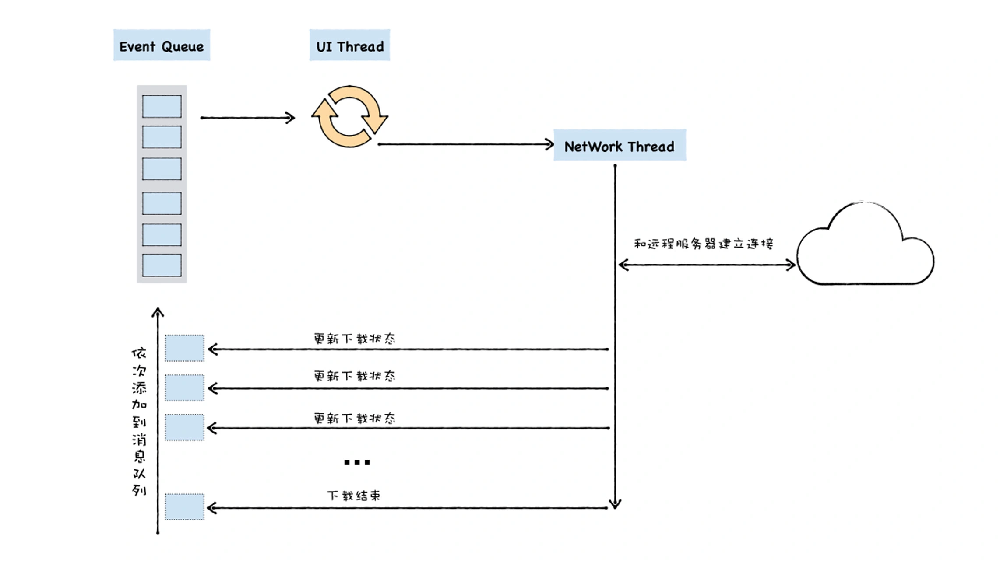

# 如何实现回调函数

https://time.geekbang.org/column/article/227926

今天我们介绍了 V8 是如何执行回调函数的。

回调函数有两种类型：同步回调和异步回调，同步回调函数是在执行函数内部被执行的，而异步回调函数是在执行函数外部被执行的。

那么，搞清楚异步回调函数在什么时机被执行就非常关键了。 为了理清楚这个问题，我们分析了通用 UI 线程宏观架构。

UI 线程提供一个消息队列，并将待执行的事件添加到消息队列中，然后 UI 线程会不断循环地从消息队列中取出事件、执行事件。

关于异步回调，这里也有两种不同的类型，其典型代表是 setTimeout 和 XMLHttpRequest。

setTimeout 的执行流程其实是比较简单的，在 setTimeout 函数内部封装回调消息，并将回调消息添加进消息队列，然后主线程从消息队列中取出回调事件，并执行回调函数。

XMLHttpRequest 稍微复杂一点，因为下载过程需要放到单独的一个线程中去执行，
所以执行 XMLHttpRequest.send 的时候，宿主会将实际请求转发给网络线程，
然后 send 函数退出，主线程继续执行下面的任务。
网络线程在执行下载的过程中，会将一些中间信息和回调函数封装成新的消息，并将其添加进消息队列中，然后主线程从消息队列中取出回调事件，并执行回调函数。

# 如何实现微任务

这节课我们主要从调用栈、主线程、消息队列这三者关联的角度来分析了微任务。

调用栈是一种数据结构，用来管理在主线程上执行的函数的调用关系。主线在执行任务的过程中，
如果函数的调用层次过深，可能造成栈溢出的错误，我们可以使用 setTimeout 来解决栈溢出的问题。

setTimeout 的本质是将同步函数调用改成异步函数调用，这里的异步调用是将回调函数封装成宏任务，
并将其添加进消息队列中，然后主线程再按照一定规则循环地从消息队列中读取下一个宏任务。

消息队列中事件又被称为宏任务，不过，宏任务的时间颗粒度太粗了，
无法胜任一些对精度和实时性要求较高的场景，而微任务可以在实时性和效率之间做有效的权衡。

微任务之所以能实现这样的效果，主要取决于微任务的执行时机，
微任务其实是一个需要异步执行的函数，执行时机是在主函数执行结束之后、当前宏任务结束之前。

因为微任务依然是在当前的任务中执行的，所以如果在微任务中循环触发新的微任务，那么将导致消息队列中的其他任务没有机会被执行。

https://time.geekbang.org/column/article/229532
