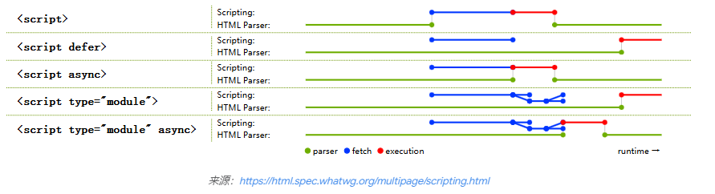

# 前言

下面内容来自 google 的专题文章 https://web.dev/explore/fast?hl=zh-cn

# 为什么要优化性能

提高转化率:
Web 性能是指网站内容在网页浏览器中的加载和渲染速度，以及对用户交互的响应。
性能不佳的网站显示和响应输入速度缓慢。
性能不佳的网站会增加用户放弃访问的概率
https://developer.mozilla.org/zh-CN/docs/Learn/Performance

## 全方位解释了性能优化的指标和一些措施

https://web.dev/articles/lcp?hl=zh-cn

实践文章：
https://keenwon.com/web-vitals/#47-fid-%E7%9A%84%E4%BC%98%E5%8C%96

# 如何测量性能

- devtool lighthouse 也有在线版本
  https://developer.chrome.com/docs/lighthouse/performance/performance-scoring?hl=zh-cn

# 考虑哪些指标(如何测量速度)
看 chrome 官方文档。https://web.dev/articles/how-to-measure-speed?hl=zh-cn

## Web Vitals

## Core Web Vitals (cwv) 

Core Web Vitals 仅包含 LCP 等三个指标，是 Web Vitals 的核心子集。而 Web Vitals 是个更广泛的概念，包含 TTFB、FCP、TBT 等更多的指标，这些指标很难在用户端实际测量，不是以用户为中心的指标，所以我们一般只作为辅助工具和补充。

### LCP Largest Contentful Paint

### CLS Cumulative Layout Shift

### INP Interaction to Next Paint

目前主要考虑 cwv

# 怎么优化

性能优化分为：网络，渲染

### 网络:

#### 体积小，加载快

- 构建策略。摇树，分割代码，按需加载，压缩
- 图片压缩。图片类型选择。
- cdn 分发。
- 缓存策略。能缓存的，尽量缓存。service worker

### 渲染

#### 解析快。执行快

- css 规则。选择器使用问题。

- dom 策略。批量操作 dom

- 解释 script 避免阻塞主线程

- 重排重绘，避免。样式合并更改。多使用 display:none
- 异步更新，代码分片

- 避免一次大量渲染 dom

- js 耗时任务，分片做。原理协程
  requestIdelCallback
  reuestAnimationFrame

- 多开一个线程 webworker

## 各种 script 对 html 解释的影响

## 参考文章
