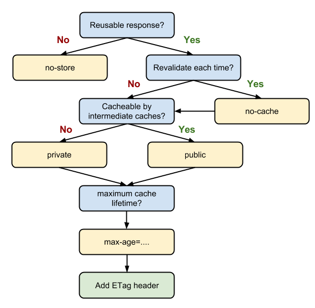

一文读懂前端缓存[https://mp.weixin.qq.com/s/cUqkG3NETmJbglDXfSf0tg]

浏览器缓存机制剖析[https://mp.weixin.qq.com/s?__biz=MjM5MTA1MjAxMQ==&mid=2651226347&idx=1&sn=6dbccc54406f0b075671884b738b1e88&chksm=bd49596f8a3ed079f79cda4b90ac3cb3b1dbdb5bfb8aade962a16a323563bf26a0c75b0a5d7b&scene=21#wechat_redirect]

HTTP 缓存介绍 MDN[https://developer.mozilla.org/zh-CN/docs/Web/HTTP/Caching#%E6%A6%82%E8%A7%88]

基本的网络请求就是三个步骤：请求，处理，响应。

后端缓存主要集中于“处理”步骤，通过保留数据库连接，存储处理结果等方式缩短处理时间，尽快进入“响应”步骤。当然这不在本文的讨论范围之内。

而前端缓存则可以在剩下的两步：“请求”和“响应”中进行。在“请求”步骤中，
浏览器也可以通过存储结果的方式直接使用资源，直接省去了发送请求；
而“响应”步骤需要浏览器和服务器共同配合，通过减少响应内容来缩短传输时间。这些都会在下面进行讨论。

本文主要包含

- 按缓存位置分类 (memory cache, disk cache, Service Worker 等)
- 按失效策略分类 (Cache-Control, ETag 等)
- 帮助理解原理的一些案例
- 缓存的应用模式

## 缓存种类

- 私有缓存
  - 客户端缓存
- 共享缓存
  - 代理缓存
  - 托管缓存

主要理解讲客户端缓存

## 缓存位置

它们的优先级是：由上到下寻找，找到即返回；找不到则继续

- Service Worker
- Memory Cache
- Disk Cache
- 网络请求

下面我们讨论的都是 Disk cache 这一类

## 缓存的 key

method + uri + (vary 字段)

## 启发式缓存

没有 Cache-Control ，满足某些条件。浏览器也会尝试缓存

## vary 的作用

精确缓存的 key, 例如加入 Accept-Language: en
响应报文中的 Vary 头字段的作用[https://juejin.cn/post/6844903981907443720]

## 按失效策略分类

### 强缓存 (未过期的缓存)

#### Expires

HTTP 1.0 的时间 明确指定时间

```http request
Expires: Tue, 28 Feb 2022 22:22:22 GMT
```

如果 Expires 和 Cache-Control: max-age 都可用，则将 max-age 定义为首选。因此，由于 HTTP/1.1 已被广泛使用，无需特地提供 Expires。

### Cache-Control: max-age

```http request
HTTP/1.1 200 OK
Content-Type: text/html
Content-Length: 1024
Date: Tue, 22 Feb 2022 22:22:22 GMT
Cache-Control: max-age=604800

<!doctype html>
…
```

604800 秒内直接缓存响应

如果在共享缓存命中，还要返回 age (即代理服务器返回 age)

Cache-Control

- max-age：即最大有效时间，在上面的例子中我们可以看到
- must-revalidate：如果超过了 max-age 的时间，浏览器必须向服务器发送请求，验证资源是否还有效。
- no-cache：虽然字面意思是“不要缓存”，但实际上还是要求客户端缓存内容的，只是是否使用这个内容由后续的对比来决定。
- no-store: 真正意义上的“不要缓存”。所有内容都不走缓存，包括强制和对比。
- public：所有的内容都可以被缓存 (包括客户端和代理服务器， 如 CDN)
- private：所有的内容只有客户端才可以缓存，代理服务器不能缓存。默认值。

```http request
HTTP/1.1 200 OK
Content-Type: text/html
Content-Length: 1024
Date: Tue, 22 Feb 2022 22:22:22 GMT
Cache-Control: max-age=604800
Age: 86400
```



收到该响应的客户端会发现它在剩余的 518400 秒内是有效的，这是响应的 max-age 和 Age 之间的差异。

### 协商缓存/对比缓存 （过期的缓存）

#### Last-Modified & If-Modified-Since

```http request
Last-Modified: Mon, 10 Nov 2018 09:10:11 GMT
```

使用 If-Modified-Since 或 If-None-Match 请求头向服务端发起验证, 验证通过返回 304 Not Modified ，不返回文件内容

如果资源更新的速度是秒以下单位，那么该缓存是不能被使用的，因为它的时间单位最低是秒。

如果文件是通过服务器动态生成的，那么该方法的更新时间永远是生成的时间，尽管文件可能没有变化，所以起不到缓存的作用。

#### Etag & If-None-Match

Etag 存储的是文件的特殊标识(一般都是 hash 生成的)，服务器存储着文件的 Etag 字段。之后的流程和 Last-Modified 一致，
只是 Last-Modified 字段和它所表示的更新时间改变成了 Etag 字段和它所表示的文件 hash，
把 If-Modified-Since 变成了 If-None-Match。服务器同样进行比较，命中返回 304, 不命中返回新资源和 200。

Etag 的优先级高于 Last-Modified

## 缓存小结

当浏览器要请求资源时

1. 调用 Service Worker 的 fetch 事件响应

2. 查看 memory cache

3. 查看 disk cache。这里又细分：

   1. 如果有强制缓存且未失效，则使用强制缓存，不请求服务器。这时的状态码全部是 200
   2. 如果有强制缓存但已失效，使用对比缓存，比较后确定 304 还是 200

4. 发送网络请求，等待网络响应

5. 把响应内容存入 disk cache (如果 HTTP 头信息配置可以存的话)

6. 把响应内容的引用 存入 memory cache (无视 HTTP 头信息的配置)

7. 把响应内容存入 Service Worker 的 Cache Storage (如果 Service Worker 的脚本调用了 cache.put())

## 缓存的应用模式


