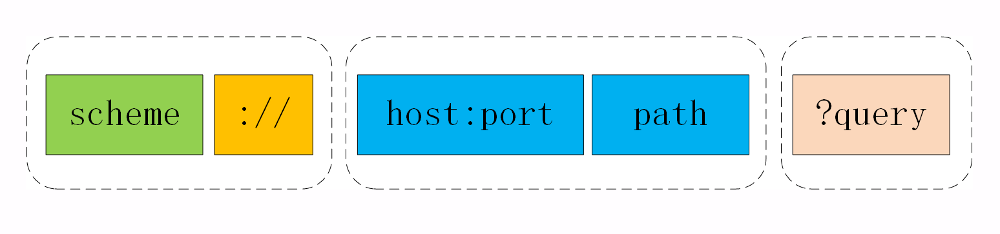
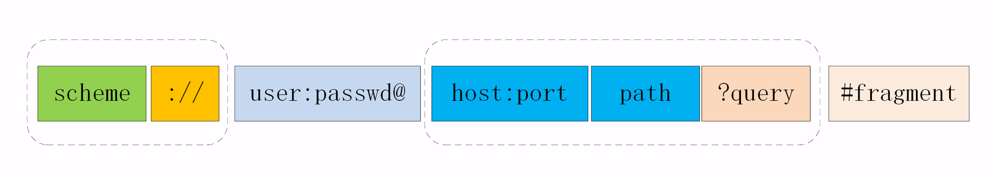

# HTTP 协议结构

请求——应答

## 报文结构

- 头部
  - 起始行
  - 头部字段
- 空行
- 实体 (可以没有)

### 请求报文

- 头部
  - 请求行
  - 头部字段
- 空行
- 实体（可以没有）

#### 请求行结构

- 请求方法
- 请求目标
- 版本号

> 这三个部分通常使用空格来分隔，最后要用换行表示结束。

| Method | SP  | URI | SP  | Version  | \n  |
| ------ | --- | --- | --- | -------- | --- |
| GET    |     | /   |     | HTTP/1.1 |     |

### 响应报文

- 头部
  - 状态行
  - 头部字段
- 空行
- 实体（可以没有）

#### 状态行结构

- 版本号
- 状态码
- 原因

| Version  | SP  | Status Code | SP  | Reason | \n  |
| -------- | --- | ----------- | --- | ------ | --- |
| HTTP/1.1 |     | 200         |     | Ok     |     |

## URI 结构

scheme + authority + path + query

URI 的 path 部分必须以“/”开始，也就是必须包含“/”，不要把“/”误认为属于前面 authority。

file:///D:/http_study/www/ 这实际上是 file 类型 URI 的“特例”，它允许省略主机名，默认是本机 localhost。

浏览器永远不会把带“#fragment”的 URI 发送给服务器，服务器也永远不会用这种方式去处理资源的片段

## URI 编码

URI 里只能使用 ASCII 码

对于 ASCII 码以外的字符集和特殊字符做一个特殊的操作，把它们转换成与 URI 语义不冲突的形式。这在 RFC 规范里称为“escape”和“unescape”，俗称“转义”

URI 转义的规则有点“简单粗暴”，直接把非 ASCII 码或特殊字符转换成十六进制字节值，然后前面再加上一个“%”。例如，空格被转义成“%20”，“?”被转义成“%3F”。

而中文、日文等则通常使用 UTF-8 编码后再转义。

