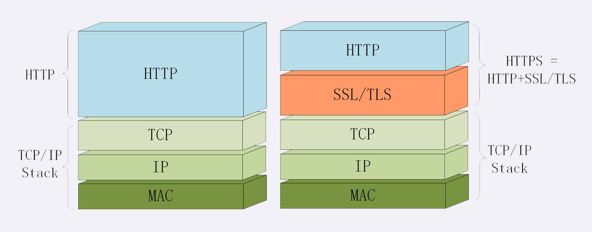
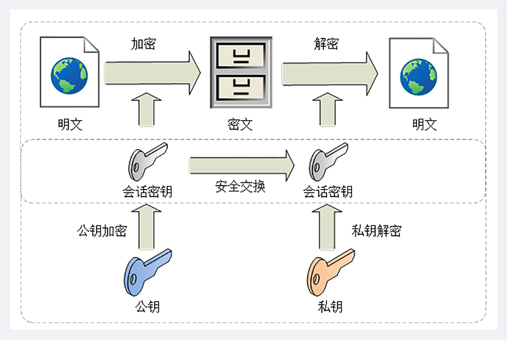
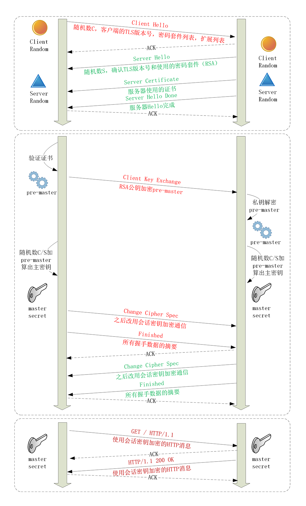
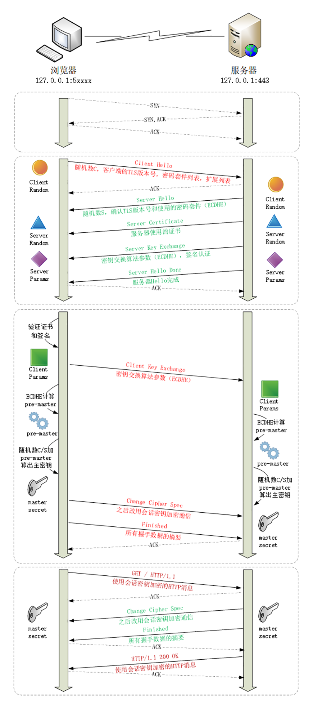
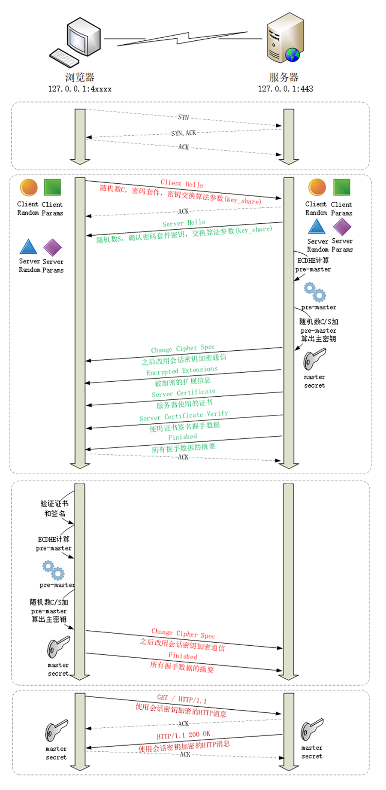
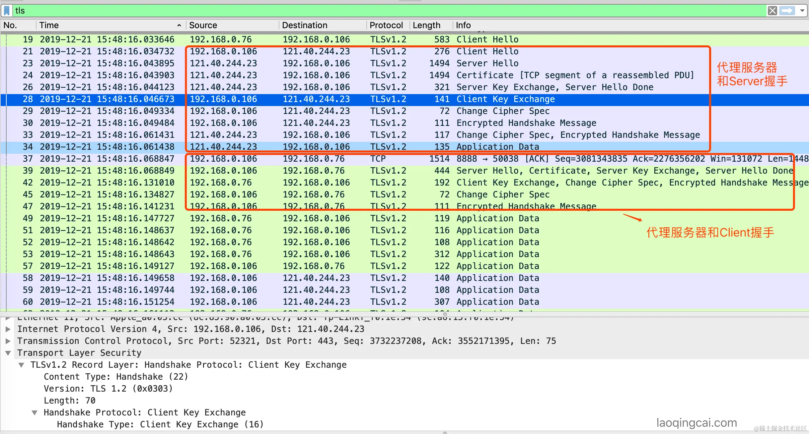

## HTTPS 要解决 HTTP 中的问题

1. 明文传输，很容易被窃听
2. 没有验证数据的完整性，容易被篡改
3. 没有验证对端的身份，容易被伪装

即： 机密性、完整性、身份认证和不可否认

机密性：对称加密 + 混合加密 (加密算法)
完整性：摘要算法实现 (摘要算法)
身份认证：数字签名 (私钥加密摘要,公钥解密摘要，对比)
不可否认：数字签名 (私钥加密摘要,公钥解密摘要，对比

上面缺了怎么保证公钥是真的？ -》 CA 说了算

下面是推演过程：
↓ 对称加密（怎么交换密钥？）
↓ 非对称加密（但基于复杂的数学难题，运行速度很慢？）
↓ 混合加密（怎么保证完整性？不被修改？）
↓ 摘要算法（怎么确认身份？提示：私钥只能本人持有,是一个身份标志）
↓ 数字签名（怎么保证公钥就是你的？提示：找第三方来保证）
↓ 数字证书、CA

## HTTPS 中的 S 代表什么

"HTTP over TCP/IP”变成 “HTTP over SSL/TLS"

SSL 即安全套接层（Secure Sockets Layer）

TLS（传输层安全，Transport Layer Security）

SSL 1.0 -> SSL 2.0 -> SSL 3.0 -> SSL3.1 === TLS 1.0 -> TLS 1.1 -> TLS 1.2 -> TLS 1.3



## TLS

对称加密: AES、ChaCha20。对称加密的分组模式：GCM、CCM 和 Poly1305

非对称加密：RSA、ECDHE(专门用于密钥交换)

cipher suite，也叫加密套件

“ECDHE-RSA-AES256-GCM-SHA384”

“密钥交换算法 + 签名算法 + 对称加密算法+（分组模式） + 摘要算法”

“握手时使用 ECDHE 算法进行密钥交换，用 RSA 签名和身份认证，握手后的通信使用 AES 对称算法，密钥长度 256 位，分组模式是 GCM，摘要算法 SHA384 用于消息认证和产生随机数。”

### 基本知识

对称加密: AES、ChaCha20
分组模式：AEAD 的 GCM、CCM 和 Poly1305
摘要算法：SHA256、SHA384
非对称加密(密钥交换算法): ECDHE 和 DHE

### TLS 握手过程

在通信刚开始的时候使用非对称算法，比如 RSA、ECDHE(现在一般使用这个)，首先解决密钥交换的问题。

基于 ECDHE 的过程证书里的公钥的功能退化为身份验证
基于 RSA 的过程证书里的公钥的功能为身份验证 + 加密传输 Pre-Master

#### RSA (TLS1.3 废除)

已经弃用，有前向安全问题，服务端私钥泄露
这张画表示使用 RSA+AES 的过程。但现在一般用 ECDHE+AES，不会用直接传递对称加密密钥



##### 使用 RSA 的 TLS 握手流程



#### ECDHE

目前普遍使用

##### ECDHE 原理解释

```markdown
Q(x, y)为全世界公认的某个椭圆曲线算法的基点

1. 客户端随机生成随机值 Ra(内存生成不传输)，计算 Pa(x, y) = Ra \* Q(x, y)。 将 Pa(x, y)发送至服务器。 (Pa 就是公钥)
2. 服务器随机生成随机值 Rb(内存生成不传输)，计算 Pb(x,y) = Rb \* Q(x, y)。 将 Pb(x, y)发送至客户端。(Pb 就是公钥)
3. 客户端计算 Sa(x, y) = Ra * Pb(x, y)；服务器计算 Sb(x, y) = Rb *Pa(x, y)
4. 算法保证了 Sa = Sb = S，提取其中的 S 的 x 向量作为密钥（预主钥 pre_master）。

Pb = rb _ q(x,y)
sa = ra _ Pb
sa = ra _ rb _ q(x,y)

Pa = ra _ q(x,y)
sb = rb _ Pa
sb = rb _ ra _ q(x,y)
```

另一版本的解释

```markdown
DH 算法解决了密钥在双方不直接传递密钥的情况下完成密钥交换，这个神奇的交换原理完全由数学理论支持。

我们来看 DH 算法交换密钥的步骤。假设甲乙双方需要传递密钥，他们之间可以这么做：

甲首先选择一个素数 p，例如 97，底数 g 是 p 的一个原根，例如 5，随机数 a，例如 123，然后计算 A=g^a mod p，结果是 34，然后，甲发送 p ＝ 97，g=5，A=34 给乙；
乙方收到后，也选择一个随机数 b，例如，456，然后计算 B = g^b mod p，结果是 75，乙再同时计算 s = A^b mod p，结果是 22；
乙把计算的 B=75 发给甲，甲计算 s ＝ B^a mod p，计算结果与乙算出的结果一样，都是 22。
所以最终双方协商出的密钥 s 是 22。注意到这个密钥 s 并没有在网络上传输。而通过网络传输的 p，g，A 和 B 是无法推算出 s 的，因为实际算法选择的素数是非常大的。

所以，更确切地说，DH 算法是一个密钥协商算法，双方最终协商出一个共同的密钥，而这个密钥不会通过网络传输。

如果我们把 a 看成甲的私钥，A 看成甲的公钥，b 看成乙的私钥，B 看成乙的公钥，
```

**DH 算法的本质就是双方各自生成自己的私钥和公钥，私钥仅对自己可见，然后交换公钥，并根据自己的私钥和对方的公钥，生成 pre-master secret，DH 算法通过数学定律保证了双方各自计算出的 pre-master secret 是相同的**

双方都共享了 master secret，所以两边可以一致地生成多个密钥，比如 key1、key2、key3，两边完全一样，本质上都是 master secret。

这样比如客户端发数据用 key1 加密，服务器就用 key1 解密；服务器发数据不用 key1，而是用 key2 加密，客户端收到数据用 key2 解密。

用多个不同的密钥就是为了安全，对抗密码分析。

注意这一步是可以发生中间人攻击的，这个时候就要靠证书保证服务端是真的。（身份：数字签名，私钥加密的内容，对应公钥才能解开。公钥怎么证明是你的：CA 证明）

### 使用 ECDHE 的 TLS1.2 握手流程 2-RTT

1. 第一次握手
   - client hello (randomA, cipher suits, tls version)
2. 第二次握手
   - server hello (randomB, chose cipher suits , tls version),
   - server certificate,
   - server exchange key (server params),
   - server hello done
3. 第三次握手
   - client exchange key(client 和 server 都拥有 randomA,randomB,server params,client params。双方可以通过 server params ,client params 生成一致的 pre_master,randomA+randomB+pre_master 再生成 master secret,master secret 再派生 server key,client key)，
   - change cipher spec (通知之后改用加密通信)
   - finished(所有握手数据的摘要)
   - http request (这时候就直接发送 http 数据了,类似 tcp fast open)
4. 第四次握手
   - change cipher spec (之后改用加密通信)
   - finished(所有握手数据的摘要)
   - http response

共 2-RTT（Round-Trip Time）



握手次数： 加上 TCP 三次握手一共七次

### 使用 ECDHE 的 TLS1.3 握手流程 1-RTT

TLS 1.3 密码套件不同包含密钥交换算法 support_groups,key_share 就可以判断


1. 第一次握手
   - client hello (randomA,support_groups 支持的曲线即密钥交换算法,key_share 曲线的参数即公钥)
2. 第二次握手
   - server hello (randomB,key_share 返回,此时已经有了 randomA,randomB,client params,server params,就可以得到 master secret)
   - change cipher spec
   - server certificate
   - finished
3. 第三次握手
   - change cipher spec
   - finished



## 常见问题

### TLS 支持双向认证和单向认证。

如果是单向认证，也就是目前大多数的用法，只发送服务器的公钥，验证服务器的身份。

如果是双向认证，那么服务器和客户端都要发送各自的公钥，互相验证对方的身份，一个常见的场景就是网银的 U 盾。

### 私钥加密后任何人都可以用公钥解密，这有什么用呢？

因为私钥只能由一个人秘密持有，所以它加密的数据谁都可以解密，没有私密性，但这就是它的价值所在，可以证明这个数据就是私钥持有人发布的，可以用来做身份认证。

1. 私钥只能被一个人秘密持有，别人是不会有的。
2. 任何人都可以用公钥解密私钥加密的数据，那么就证明数据是被对应的私钥加密的。
3. 从 1/2 可以推出，数据必然是私钥持有者发出的，否则公钥必然会解密失败。
4. 从 3 推出，发送者就是私钥持有者，也就确认了发送者的身份。

### TLS ECDHE 算法过程思考

算法保证双方都能算出一个同样的私钥，作为对称加密的基础。
明文传输，安全实际上靠的是证书体系保证。而且因为私钥不会直接传输交换，只需要保证通信双方是可信的就行了。
因此如果信任了第三方根证书,中间人动态生成服务器证书，就可以做到中间人攻击。
比如代理抓包，由 A - C 变成 A-B-C 。B 跟 A,C 各自建立通信，从而拦截 A C。

https://juejin.cn/post/6908911791389016071

