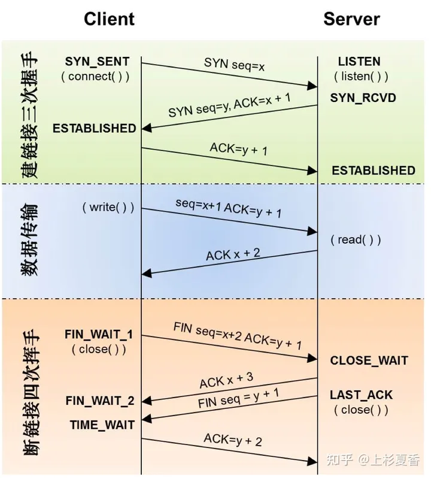

# TCP 连接的建立 - 三次握手

条件:

- 在客户端尝试与服务器连接之前，服务器必须首先绑定并侦听端口以打开端口以进行连接。
  即：被动打开( passive open)
- 一旦建立了被动打开，客户端就可以发起主动打开。

建立连接:

1. SYN: The active open is performed by the client sending a SYN to the server. The client sets the segment's sequence number to a random value A.
2. SYN-ACK: In response, the server replies with a SYN-ACK. The acknowledgment number is set to one more than the received sequence number i.e. A+1, and the sequence number that the server chooses for the packet is another random number, B.
3. ACK: Finally, the client sends an ACK back to the server. The sequence number is set to the received acknowledgement value i.e. A+1, and the acknowledgement number is set to one more than the received sequence number i.e. B+1.

完成：

- 此时，客户端和服务器都已收到连接的确认。
- 步骤 1、2 建立一个方向的连接参数（序列号），并确认该参数。
- 步骤 2、3 为另一个方向建立连接参数（序列号），并确认该参数。
- 利用这些，建立了全双工通信

# TCP 的断开 - 四次挥手

因为 TCP 是全双工通信的

1. 第一次挥手  
   因此当主动方发送断开连接的请求（即 FIN 报文）给被动方时，仅仅代表主动方不会再发送数据报文了，但主动方仍可以接收数据报文。
2. 第二次挥手  
   被动方此时有可能还有相应的数据报文需要发送，因此需要先发送 ACK 报文，告知主动方“我知道你想断开连接的请求了”。这样主动方便不会因为没有收到应答而继续发送断开连接的请求（即 FIN 报文）。
3. 第三次挥手  
   被动方在处理完数据报文后，便发送给主动方 FIN 报文；这样可以保证数据通信正常可靠地完成。发送完 FIN 报文后，被动方进入 LAST_ACK 阶段（超时等待）。
4. 第四挥手  
   如果主动方及时发送 ACK 报文进行连接中断的确认，这时被动方就直接释放连接，进入可用状态。

为什么“握手”是三次，“挥手”却要四次？

TCP 建立连接时之所以只需要"三次握手"，是因为在第二次"握手"过程中，服务器端发送给客户端的 TCP 报文是以 SYN 与 ACK 作为标志位的。SYN 是请求连接标志，表示服务器端同意建立连接；ACK 是确认报文，表示告诉客户端，服务器端收到了它的请求报文。

即 SYN 建立连接报文与 ACK 确认接收报文是在同一次"握手"当中传输的，所以"三次握手"不多也不少，正好让双方明确彼此信息互通。

TCP 释放连接时之所以需要“四次挥手”,是因为 FIN 释放连接报文与 ACK 确认接收报文是分别由第二次和第三次"握手"传输的。为何建立连接时一起传输，释放连接时却要分开传输？

建立连接时，被动方服务器端结束 CLOSED 阶段进入“握手”阶段并不需要任何准备，可以直接返回 SYN 和 ACK 报文，开始建立连接。
释放连接时，被动方服务器，突然收到主动方客户端释放连接的请求时并不能立即释放连接，因为还有必要的数据需要处理，所以服务器先返回 ACK 确认收到报文，经过 CLOSE-WAIT 阶段准备好释放连接之后，才能返回 FIN 释放连接报文。

所以是“三次握手”，“四次挥手”。



# 常见问题

## syn 的时候应答为什么要 ack + 1

```markdown
// ' i o u a b c
// 0 1 2 3 4 5 6
//
// seq = 1 len=2 || ack 3 你下次就从 seq=3 开始发
// seq = 3 len=2 || ack 5 你下次就从 seq=5 开始发
// syn 的时候随机数偏移一位,后续传输的时候就可以满足 ack = seq + len
```

这是因为 ACK 标志位指示的是期望下次收到的数据的序列号。

而在 TCP 连接建立过程中，发送端并没有发送数据。seq = 0, len = 0。

这样下次要接收的序列号即为发送端发送的 SYN 包的序列号，无法表达已经收到了这个包。

因此需要将 ACK 标志位的值设置为 SYN + 1，以表示确认了这个 SYN 包，

同时偏移一位后，后续传输可以满足 ack = seq + len。
